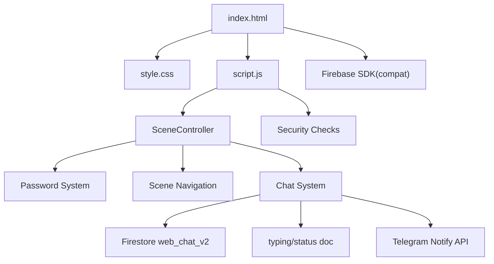

# Project Context

> **Last verified**: against commit `86efed0` on `test-branch`.
> This document supersedes all earlier versions and reflects the **current** state of the code (post "critical fixes + mobile + premium polish + git workflow hardening" update).

---

## 1. Project Summary

**Confirmed**

- **Project Purpose**: A personalized birthday surprise website for two people, **Bhatari** (sender / left bubble) and **Bhandhari** (recipient / right bubble). Branding references a "Penguin 🐧" mascot.
- **Business/Domain**: Personal celebration/greeting web application with an interactive real-time chat finale.
- **Primary Goals**:
  - Deliver an emotional, cinematic birthday experience
  - Present a visual journey through shared memories (photo ladder)
  - Show a handwritten-style letter (envelope scene)
  - Provide a private, real-time two-way chat as the grand finale
- **Major Features**:
  - Password-protected entry (4-digit code, SHA-256 hash verification)
  - 3-scene sequential experience: Image Ladder → Envelope Letter → Chat
  - "Jump to Chat" shortcut from the ladder scene
  - Chat scene protected by a separate 4-digit PIN + on-screen keypad (lockout on 3 failures)
  - Real-time chat over **Firebase Firestore** with typing indicators, replies, inline edit, date dividers, connection status
  - Identity toggle (Bhatari ↔ Bhandhari) inside the chat
  - "Notify Bhatari" button (Telegram Bot API) with 10s cooldown
  - Privacy re-lock on tab switch (whole app returns to password screen)
  - Offline detection overlay
- **Technology Stack**:
  - HTML5, CSS3, Vanilla JavaScript (no frameworks/build tools)
  - Firebase (Firestore) via compat SDK 10.12.2 for real-time chat
  - Telegram Bot API (server-side-free) for the notify button and legacy reply delivery
- **High-Level Architecture**: Single-page application (SPA) with scene-based navigation, a password protection layer, and two external backends (Firestore for chat, Telegram for notifications).

---

## 2. Repository Instructions

> Before making any changes to the project, always locate and read the repository's `instructions.md` file (if it exists). Treat it as the authoritative source for project-specific development conventions, workflows, coding standards, constraints, and implementation guidelines.

**Status**: The repository contains an `instructions.md` file at `/workspace/instructions.md`. It mandates that terminal commands be actually executed (with full output shown), a strict Git workflow (verify → change → review → commit → push → verify), and a prohibition on destructive git operations. A `task.md` at `/workspace/task.md` also exists; it documents the *planned* Telegram-based chat architecture which **differs from the implemented Firestore-based chat** (see §21 – Discrepancies & Notes).

---

## 3. Architecture

**Confirmed**

### Overall Architectural Style
- **Type**: Client-side Single Page Application (SPA)
- **Pattern**: Scene-based state machine with sequential navigation (`SceneController`)
- **Deployment**: Static files served directly (no backend server)

### System Layers
```
┌──────────────────────────────────────────────┐
│            Presentation Layer                │
│  (index.html - HTML structure & DOM)         │
├──────────────────────────────────────────────┤
│             Styling Layer                    │
│   (style.css - CSS3, glassmorphism, anims)   │
├──────────────────────────────────────────────┤
│           Controller Layer                   │
│   (script.js - SceneController + chat logic) │
├──────────────────────────────────────────────┤
│            External Integration              │
│   (Firebase Firestore via compat SDK)        │
│   (Telegram Bot API via fetch)               │
└──────────────────────────────────────────────┘
```

### Major Subsystems
1. **Password Protection System** — sessionStorage-based lockout (3 attempts → 15s), SHA-256 hash verification
2. **SceneController** — state machine managing 3 sequential scenes (ladder → envelope → chat)
3. **Security Layer** — network monitoring (online/offline) + privacy re-lock on `visibilitychange`
4. **Firestore Chat System** — real-time messaging (`web_chat_v2`), typing status, replies, inline edit
5. **Chat PIN Lock** — second access gate with on-screen keypad and its own lockout
6. **Telegram Integration** — "Notify Bhatari" push; legacy reply delivery (dead)
7. **Visual Effects** — bokeh particles, confetti, floating hearts, envelope/ladder animations

### Dependency Direction
```
index.html → style.css (styles)
index.html → script.js (logic)
index.html → Firebase SDK (scripts)
script.js → Firebase Firestore (chat)
script.js → Telegram Bot API (notify / legacy)
```

### Component Relationships (Mermaid)


### Request Lifecycle
1. Page loads → password overlay displayed (or lockout countdown if previously locked)
2. User enters code → SHA-256 hash validation
3. Success → main content revealed with intro transition → `initMainApp()`
4. `SceneController` starts → Scene 1 (Ladder) shown after ~600ms
5. Navigation: Ladder → Envelope → Chat (or "Jump to Chat" skips to index 2)
6. Chat scene boots Firestore listeners after PIN unlock

### Data Lifecycle
```
Chat: User types → optimistic UI via Firestore snapshot → persisted in Firestore → real-time sync to other identity
Notify: Button click → POST to Telegram Bot API → cooldown countdown → toast
```

---

## 4. Repository Structure

| Directory | Purpose | Responsibilities | Important Contents |
|-----------|---------|------------------|-------------------|
| `/` (root) | Main application | Entry point, core logic | `index.html`, `script.js`, `style.css`, `instructions.md`, `task.md`, `project-context.md` |
| `images/` | Asset storage | Photo assets for ladder scene | `image1.png/webp`, `image2.png/webp`, `image3.png/webp` |
| `songs/` | Audio storage | Background music | `song1.mp3` |

**Dependencies**:
- `images/` referenced by `index.html` (ladder scene `<picture>` with webp + png fallback)
- `songs/` **NOT referenced anywhere** — orphaned asset (see §21)
- `.stylelintrc.json` configures CSS linting (no package.json; no JS linter)

---

## 5. Key Files

| File Path | Responsibility | Why Important |
|-----------|---------------|---------------|
| `index.html` | Application entry point, DOM structure, all 3 scenes, overlays | Defines password/offline overlays, ladder, envelope, chat scene, loads Firebase SDK |
| `script.js` | Application logic, SceneController, chat system, Telegram | Contains password + PIN logic, Firestore chat, typing/reply/edit, notify |
| `style.css` | Visual styling, animations, responsive design | Implements glassmorphism, chat bubbles, PIN pad, mobile-first `100dvh` layout |
| `.gitignore` | Git exclusion rules | Prevents committing build artifacts, deps, temp files |
| `.stylelintrc.json` | CSS linting configuration | Enforces `color-no-invalid-hex`, `block-no-empty` |
| `instructions.md` | Development guidelines | Authoritative source for coding standards and git workflow |
| `task.md` | Original chat implementation plan | Documents the *intended* Telegram architecture (diverged in implementation) |
| `project-context.md` | This document | Technical reference for AI assistants |

---

## 6. Core Modules and Components

### SceneController Class (`script.js:209-320`)
- **Responsibility**: Manages sequential scene navigation and state
- **Scene sequence**: `scene-ladder` → `scene-envelope` → `scene-chat`
- **Public Interface**: `showScene(index)`, `nextScene()`, `previousScene()`, `reset()`
- **Scene entry hooks** (`onSceneEnter`, `script.js:313-319`): `enterLadderScene()`, `enterEnvelopeScene()`, `initChatScene()`
- **Reset behavior** (`script.js:221-272`): hides all scenes, resets ladder cards/scroll-hint, envelope (`envelopeOpened = false`), clears confetti, resets legacy reply box elements (now no-ops — see §21)
- **Note**: legacy `scene-dua`, `scene-q1`–`scene-q5` are gone; chat replaced them

### Password System (`script.js:9-153`)
- **Responsibility**: Authentication gate with lockout protection
- **Public Interface**: `checkPassword()` async function
- **Details**:
  - SHA-256 hash constant at `script.js:17` (`277375b99e…`), also reused as the chat PIN hash (`script.js:1129`)
  - Lockout: 3 failed attempts → 15 seconds, persisted via sessionStorage (`pwd_attempts`, `pwd_lockout_end`)
  - Countdown timer and disabled input/button during lockout; auto-clear on expiry
  - 4-digit input (`maxlength=4`), Enter key and button both submit

### Chat PIN Lock (`script.js:1043-1198`)
- **Responsibility**: Second access gate on the chat scene
- **Details**:
  - On-screen keypad (`.pin-key`) with clear `✕` and backspace `⌫`; dots UI; haptic feedback via `navigator.vibrate`
  - Verifies SHA-256 of the entered 4-digit PIN against the same hash as the main lock
  - 3 failures → 15s lockout (in-memory `chatState`; resets on re-entry)
  - Randomized input field name/id to defeat browser autofill recognition
  - On success: hides overlay, shows identity toast ("You are chatting as …")

### Firestore Chat System (`script.js:864-1833`)
- **Firebase config**: `script.js:867-874` (project `web-app-511d5`)
- **Collection**: `CHATS_COL = 'web_chat_v2'` (`script.js:896`)
- **Typing doc**: `TYPING_DOC = db.doc('typing/status')` (`script.js:897`)
- **Offline persistence**: `db.enablePersistence()` with graceful multi-tab handling (`script.js:881-894`)
- **Sub-modules**:
  - `initChatScene()` (`1200-1274`) — wires listeners once, defaults identity to **Bhandhari**
  - `startMessageListener()` (`1277-1311`) — `orderBy('timestamp','asc').limitToLast(20)` real-time snapshot
  - `startTypingListener()` (`1313-1338`) — reads `typing/status` doc for the *other* identity, shows/hides typing bubble
  - `reconcileMessages()` (`1341-1415`) — smart DOM reconciliation with date dividers, no full rebuild
  - `createBubble()` / `updateBubble()` (`1418-1547`) — bubble rendering incl. reply quote, edited tag, Reply/Edit actions
  - `startEdit()` / `cancelEdit()` (`1550-1700`) — inline editing of own messages (max 2000 chars)
  - `handleSend()` / `sendMessage()` (`1703-1731`) — writes to Firestore with `serverTimestamp`
  - `handleReply()` / `cancelReply()` (`1734-1754`) — reply preview bar + quote box
  - Typing in/out (`1757-1786`) — debounced 3s typing heartbeat, 4s reset
  - Remote typing indicator (`1789-1833`) — auto-hide after 6s
  - `updateConnectionStatus()` (`1842-1852`) — "✅ Connected" / "⏳ Reconnecting…"

### Telegram Integration (`script.js:620-622`, `904-958`)
- **Credentials** (hardcoded): `TG_BOT_TOKEN` (`script.js:621`), `TG_CHAT_ID = '6219378525'` (`script.js:622`)
- **`notifyBhatari()`** (`904-954`): POSTs a 🔔 message to Telegram when Bhandhari taps "Notify Bhatari"; 10s cooldown with countdown text on the button
- **Legacy `sendReplyToTelegram()`** (`676-711`): formats "New Birthday Reply" Markdown — **dead code** (no live callers, see §21)

### Visual Effects
- **Bokeh particles** (`357-383`): 8 animated background orbs, self-resetting loop
- **Confetti** (`387-416`): mobile-aware count (30 mobile / 50 desktop), cleanup after 4s — only triggered from dead reply path
- **Floating hearts** (`336-344`, `1859-1872`): 💜 on non-button taps, 250ms throttle
- **Envelope/Ladder animations**: CSS-driven (see `style.css` §6)

---

## 7. Data Flow

**Confirmed**

### User Input Flow
```
1. Enter password → SHA-256 → match → reveal content → initMainApp()
2. SceneController shows Scene 1 (Ladder); Continue → Scene 2 (Envelope); Continue → Scene 3 (Chat)
3. Chat requires PIN → Firestore listeners boot → real-time messaging between identities
```

### Chat Message Flow (Firestore)
```
sendMessage():
  chatState.replyToMessage → db.collection('web_chat_v2').add({sender, text, timestamp: serverTimestamp(), replyTo, isEdited:false})
  → onSnapshot fires → reconcileMessages() renders bubble (pending state until server ack)
incoming:
  snapshot → parse sender (normalizeSender) → create/update bubble → scroll if near bottom
```

### Typing Flow
```
Outgoing: input event → if >3s since last → typing/status.set({[identity]: {isTyping, at}})
          → reset timer (4s) clears typing
Incoming: typing/status snapshot → other identity isTyping && age<6s → show bubble (auto-hide 6s)
```

### Validation Flow
- Password & PIN: SHA-256 via Web Crypto API
- Offline check: `navigator.onLine` blocks sends and shows offline overlay
- Edit: empty / whitespace / unchanged text blocked with toast

### Persistence Flow
- Password attempts/lockout → `sessionStorage`
- Chat messages/typing → Firestore (server-persisted)
- Chat PIN lockout → in-memory only (reset on scene re-entry)

---

## 8. Application Flow

**Confirmed**

### Startup Sequence
1. `DOMContentLoaded` → password system init from sessionStorage
2. Lockout restored if `pwd_lockout_end > now` (countdown)
3. Network status checked (`handleNetworkChange`)
4. Event listeners attached (online/offline, visibilitychange)

### Initialization (post-authentication)
1. `initMainApp()` (`326-350`)
2. Bokeh setup, `SceneController` instantiated, stored as `window._sceneController`
3. Heart-on-click handler attached
4. `controller.showScene(0)` after 600ms → `enterLadderScene()`

### Routing
- No URL routing; scene-based state machine, sequential + jump shortcut
- "Jump to Chat" (`ladder-jump-chat-btn`, `script.js:509-514`) → `showScene(2)`

### Authentication Flow
```
Password Input → SHA-256 → compare hash
  → Success: hide overlay, init app
  → Fail: increment; <3 → remaining attempts msg; >=3 → 15s lockout (disabled UI, countdown)
```

### Event Handling
- Buttons: unlock, ladder continue/jump, envelope seal/close/continue, notify, identity toggle, PIN pad, chat send, reply cancel, edit save/cancel
- Window events: `online`/`offline`, `resize` (ladder string), `visibilitychange` (re-lock)
- Document click: floating hearts

### Shutdown / Re-lock Behavior
- Tab switch (`visibilitychange`) → blackout + full password re-lock; `SceneController.reset()` so experience replays from Scene 1
- sessionStorage cleared on tab close

---

## 9. State Management

**Confirmed**

### Global State
- `window._sceneController`: SceneController instance (`script.js:332`)

### Chat State (`chatState`, `script.js:997-1013`)
| Field | Purpose |
|-------|---------|
| `currentIdentity` | `'Bhatari'` or `'Bhandhari'` (default Bhandhari) |
| `messages` | Message array from Firestore snapshot |
| `unsubMessages` / `unsubTyping` | Firestore unsubscribe functions |
| `replyToMessage` | Active reply target `{id, text, sender}` |
| `lastTypingSentTime` / `typingResetTimer` | Outgoing typing throttling |
| `remoteTyping` | Remote typing indicator state `{sender, timer}` |
| `renderedIds` | `Map<id, DOMElement>` for reconciliation |
| `editingMessageId` / `editBoxes` | Inline edit tracking |
| `chatUnlocked`, `pinInput`, `failedAttempts`, `lockoutEndTime` | Chat PIN lock state |

### Password State
- `failedAttempts`, `lockoutEndTime`, `isLockedOut` (backed by sessionStorage)

### Persistence Strategy
- Chat data: Firestore (persistent, cross-device)
- Password lockout: sessionStorage (volatile per tab session)
- Chat PIN lockout: memory only

---

## 10. Database and Storage

**Confirmed**

- **Primary**: Firebase Firestore
  - Collection `web_chat_v2`: chat messages
  - Document `typing/status`: real-time typing indicator
- **Local**: `sessionStorage` for password lockout; browser cache for static assets
- **Schema**: Firestore is schemaless; message shape is set by the writer (see §13)
- **ORM**: None (raw Firestore compat SDK calls)

---

## 11. APIs

### Internal APIs
None (monolithic frontend application). Shared helpers: `normalizeSender`, `formatDateLabel`, `showToast`, `updateConnectionStatus`.

### External APIs

**Firebase Firestore** (`script.js:867-894`)
- **Service**: Google Firebase (project `web-app-511d5`)
- **Endpoints**: collection `web_chat_v2`; document `typing/status`
- **Authentication**: web API key + Firestore Security Rules (rules not in repo — must be configured in Firebase console)
- **Error Handling**: snapshot error → `updateConnectionStatus(false)`; persistence errors warn and degrade gracefully

**Telegram Bot API** (`script.js:904-958`)
- **Service**: Telegram Messenger
- **Endpoint**: `https://api.telegram.org/bot{TOKEN}/sendMessage`
- **Auth**: bot token in URL (hardcoded `script.js:621`)
- **Payload**: `{chat_id: "6219378525", text, parse_mode: "HTML"}` for notify
- **Error handling**: non-ok response → toast + button re-enabled
- **Rate limiting**: 10s cooldown on notify button
- **Note**: legacy `sendReplyToTelegram` (Markdown `sendMessage`) is dead code

---

## 12. Authentication and Security

**Confirmed**

### Authentication Flow
- **Main lock**: SHA-256 hash comparison (`script.js:17`); hash `277375b99e186c72ac38ac47b03199038342fe0389be8765476fa2be0c5b5649`
- **Chat lock**: same hash reused as PIN verification (`script.js:1129`)
- **Session management**: sessionStorage attempt/lockout tracking

### Authorization Model
- Binary per gate: locked vs unlocked (password + PIN); no roles
- Identity is a UI toggle, not an auth boundary — any visitor can message as either identity

### Secret Management (⚠️)
- **Telegram bot token** hardcoded & exposed in client (`script.js:621`)
- **Telegram chat ID** hardcoded (`script.js:622`)
- **Firebase web config** hardcoded (`script.js:867-874`) — web API keys are public by design; actual protection is the Firestore rules
- **Password/PIN hash** stored client-side (obscurity only)

### Encryption / Validation
- SHA-256 hashing for password/PIN (obfuscation, not real security)
- Chat messages rendered via `textContent` (mitigates stored-XSS from message content)
- Network status checked before sends

### Security-Sensitive Areas
1. Hardcoded Telegram bot token (real credential; anyone can hijack the bot)
2. Client-side auth + reused hash (no server enforcement)
3. Firestore rules out-of-repo — if overly permissive, chat is writable by anyone
4. No input sanitization server-side (Firestore security rules would be the enforcement point)
5. Identity impersonation possible (anyone can toggle to either identity)

---

## 13. Configuration

**Confirmed**

### Environment Variables
None. All configuration is hardcoded in `script.js`.

### Config Files
- `.stylelintrc.json`: `color-no-invalid-hex`, `block-no-empty`

### Feature Flags
None.

### Runtime Configuration (hardcoded)
- `CORRECT_PASSWORD_HASH` / `CORRECT_PIN_HASH`: `script.js:17` & `1129`
- `TG_BOT_TOKEN`, `TG_CHAT_ID`: `script.js:621-622`
- `FIREBASE_CONFIG`: `script.js:867-874`
- `CHATS_COL = 'web_chat_v2'`: `script.js:896`
- Lockout: 3 attempts / 15s (both locks)
- Notify cooldown: 10s
- Typing throttle: 3s out / 6s in auto-hide
- Message cap: 2000 chars (edit input maxLength)
- Snapshot window: last 20 messages

### Build Configuration
None (no build process; static files served directly).

---

## 14. Dependencies

**Confirmed**

### External Libraries (CDN in `index.html`)
| Library | Purpose | Why Exists |
|---------|---------|------------|
| Google Fonts (Outfit, Lora, Caveat, Playfair Display) | Typography | Cinematic, emotional design aesthetic |
| Firebase App compat SDK 10.12.2 (`index.html:296`) | Firebase bootstrap | Initialize Firestore |
| Firebase Firestore compat SDK 10.12.2 (`index.html:297`) | Real-time database | Chat backend |

### Built-in APIs Used
| API | Functionality | Architectural Significance |
|-----|---------------|---------------------------|
| `fetch` | Telegram notify calls | Push notifications without a backend |
| `sessionStorage` | Lockout persistence | Survives page reloads |
| `crypto.subtle` (Web Crypto) | SHA-256 hashing | Password/PIN verification |
| `navigator.onLine` / window events | Network detection | Offline UX |
| `navigator.vibrate` | Haptic feedback | Mobile polish (PIN pad, envelope) |
| `requestAnimationFrame` | Smooth transitions | Cinematic effects |

### No npm/package.json
- Pure vanilla JS + Firebase CDN; zero build dependencies

---

## 15. Development Workflow

**Inferred** (based on file structure and absence of tooling)

### Installation
- None required; clone repository and serve static files

### Local Development
- Option 1: Open `index.html` directly in a browser
- Option 2: Simple HTTP server (e.g., `python3 -m http.server`)
- Option 3: VS Code Live Server extension

### Build Process
- None; files are production-ready as-is

### Testing
- Manual testing in browser; no automated test suite

### Linting
- CSS: stylelint (minimal rules in `.stylelintrc.json`)
- JavaScript: none configured

### Formatting / Type Checking
- None (vanilla JS)

### Deployment
- Host static files anywhere with HTTPS
- **Critical**: Firestore Security Rules must be configured in the Firebase console (they live server-side, not in this repo)
- Update Telegram bot token / Firebase config if changed

### CI/CD Workflow
- None configured; manual deployment expected

---

## 16. Coding Conventions and Project Patterns

**Inferred** from existing codebase

### Folder Organization
- Flat root with `images/` and `songs/` asset dirs; all logic in root files

### Naming Conventions
- **CSS**: kebab-case selectors; `--kebab-case` variables in `:root` (`style.css:6-31`)
- **JS**: camelCase functions/vars, PascalCase class (`SceneController`), `const` section constants
- **HTML IDs**: kebab-case with prefixes (`scene-`, `chat-`, `ladder-`, `envelope-`, `pin-`)

### Error Handling
- `try/catch` around async Firebase writes and PIN hashing; `console.error`/`console.warn`
- User-facing toasts (`showToast`) for chat errors; inline error messages for locks

### Logging
- `console.error()` for failures; `console.warn()` for persistence/typing issues
- Note: old docs claimed a "security layer clears console.log" — no such clearing exists in current code

### Async Patterns
- `async/await` with fetch (Telegram); Firestore SDK promises + `onSnapshot` callbacks

### Architectural Patterns
- State machine (`SceneController`), event-driven DOM, real-time sync via Firestore listeners, smart DOM reconciliation (no full re-render)

### Comment Style
- ASCII-art section banners (`/* ===== … ===== */`, `// ─── … ───`), inline notes; some comments are **stale** (see §21)

---

## 17. Business Logic

**Confirmed**

### Domain Concepts
- **Birthday Celebration**: core purpose; all features serve this goal
- **Journey Narrative**: "Then · Now · Always" ladder theme; handwritten letter
- **Real-Time Exchange**: chat replaces the earlier Q&A reply scenes

### Workflows
1. **Unlock Flow**: password → content (progressive lockout)
2. **Scene Navigation**: linear ladder → envelope → chat (+ jump shortcut)
3. **Chat Flow**: PIN unlock → identity toggle → message/reply/edit → Firestore sync
4. **Notify Flow**: Bhandhari taps Notify → Telegram message → cooldown

### Validation Rules
- Password/PIN: SHA-256 must match stored hash
- Message: non-empty; edit: non-empty, changed
- Network required for sending
- 3 attempts → 15s lockout on both locks

### Decision Logic
- Lock success → reveal; failure <3 → remaining attempts; ≥3 → lockout
- Offline → block + overlay; empty message → toast/block
- Reply target → preview bar; cancel → clears
- Identity toggle → re-render edit-button visibility + notify button visibility
- Edit unchanged → cancel; save error → re-enable inputs + copy text to clipboard

---

## 18. Known Limitations

**Confirmed**

### Technical Debt / Issues
1. **Hardcoded secrets in client** — Telegram bot token + chat ID, Firebase config, password/PIN hash (`script.js:17, 1129, 621-622, 867-874`)
2. **Dead code (legacy reply/question system)** — see §21 for the full list
3. **Latent bug: `charCounter` undefined** — `script.js:1589` references `charCounter` which is never declared; typing in the edit box throws a `ReferenceError` (breaks auto-resize of the edit input)
4. **Latent bug: wrong class in `updateBubble`** — `script.js:1442` queries `.chat-actions-row`, but bubbles use `.chat-bubble-actions` (`script.js:1523`); edit-button visibility updates there are a no-op (partially compensated by the toggle handler at `1245-1248`)
5. **Stale comment/logic mismatch** — `script.js:1266` says Bhatari is default, but default identity is Bhandhari (`1219-1220`); notify button hidden on first load even though identity = Bhandhari until the toggle is clicked
6. **`updateBubble` edit-button check** (`1445`) reads the first `.chat-action-btn` (Reply), not the Edit button — logic never matches
7. **Orphaned asset** — `songs/song1.mp3` referenced nowhere; empty "MUSIC PLAYER SCENE STYLES" CSS block (`style.css:1873-1877`)
8. **Dead CSS** — legacy reply-box, question-scene, dua styles remain (`style.css:1321-1872`)
9. **No automated tests**, no JS linting, no CI
10. **Re-lock UX**: any tab switch forces full password re-entry and scene reset
11. **Client-side security theater** — hash-based locks are bypassable via DevTools; Firestore rules are the real enforcement (not in repo)

### Missing Features (relative to `task.md`)
- Telegram-based message sync (getUpdates polling, `__TYPING__::` payloads, prefix parsing) was **not implemented** — Firestore was used instead
- Telegram channel (id `-1003904588299`) from `task.md` is not used by the code
- Only "Notify Bhatari" (one-direction Telegram push) exists

### Edge Cases
- Multi-tab: `enablePersistence` warns `failed-precondition`
- Long messages truncated in quote previews (60/70 chars) and edit cap 2000
- Message send failure → toast, input text already cleared (potential data loss)
- Timestamp fallback to `Date.now()` when `serverTimestamp` pending

### Assumptions
- Two trusted people (Bhatari/Bhandhari) share the chat
- Trusted hosting environment
- Firebase project + Telegram bot remain active

### Design Tradeoffs
- Simplicity over security (personal gift)
- Vanilla JS + Firebase CDN over a framework/build system
- Hardcoded config over environment variables

---

## 19. File Reference Index

| Repository Path | Responsibility |
|-----------------|---------------|
| `index.html` | HTML structure: overlays, 3 scenes, Firebase SDK loading |
| `script.js` | All logic: locks, SceneController, Firestore chat, Telegram, effects |
| `style.css` | All visual styling, animations, responsive design |
| `instructions.md` | Development guidelines & git workflow |
| `task.md` | Original (superseded) Telegram chat implementation plan |
| `project-context.md` | This document |
| `.gitignore` | Git exclusion patterns |
| `.stylelintrc.json` | CSS linting configuration |
| `images/image1.png`, `image1.webp` | Childhood photo (ladder) |
| `images/image2.png`, `image2.webp` | Growing up photo (ladder) |
| `images/image3.png`, `image3.webp` | Current photo (ladder) |
| `songs/song1.mp3` | **Orphaned** audio asset (not referenced) |

---

## 20. AI Working Notes

**Guidance for Future AI Assistants**

### Safe Places to Modify
- `style.css`: add styles following `:root` variable + section-banner pattern
- `index.html`: text content, chat scene markup (match IDs used by `script.js`)
- `script.js`: chat scene logic (Firestore collection name, listeners, bubble rendering)

### Files Requiring Coordinated Changes
- Adding a chat feature requires: HTML (`index.html` chat scene) + CSS (`style.css` chat section) + JS (`script.js` chat module) + optional Firestore rules in the console
- Changing chat storage: update `CHATS_COL` (`script.js:896`) **and** any Firestore rules

### Hidden Coupling
- Scene IDs must match `SceneController.scenes` array (`script.js:212-216`)
- DOM IDs referenced by JS must exist in HTML (see §5; verify before editing)
- Chat identity strings `'Bhatari'` / `'Bhandhari'` are coupled to `normalizeSender` (`script.js:1016-1021`), toggle `data-identity` attributes, and the typing doc keys
- The same SHA-256 hash gates both the main lock and the chat PIN

### Frequently Overlooked Dependencies
- Firebase compat SDKs loaded at `index.html:296-297` before `script.js`
- Google Fonts affect all typography
- Firestore Security Rules (outside repo) control who can read/write `web_chat_v2`
- Notify feature depends on `TG_BOT_TOKEN`/`TG_CHAT_ID` (`script.js:621-622`)

### Common Implementation Pitfalls
1. Editing DOM elements the JS no longer references (legacy reply system) — dead code
2. Forgetting Firestore rules when changing collection names
3. Not handling offline/`navigator.onLine` in new chat features
4. Re-introducing XSS: always render message text via `textContent`/`textContent`-equivalent
5. Breaking the identity/typing coupling when renaming identities

### Recommended Order for Implementing New Features
1. Update `chatState` and DOM IDs in HTML
2. Add CSS following the chat scene patterns
3. Implement JS with proper listener wiring (guard with `chatSceneInited`)
4. Update Firestore rules in the console
5. Test on mobile + offline + multi-tab

### Areas to Modify Cautiously
- **Firestore collection/doc names**: breaks persistence & rules
- **Telegram creds**: breaks notify
- **Password/PIN hash**: breaks access control
- **`SceneController` core**: central to navigation
- **Re-lock (`visibilitychange`)**: privacy behavior users rely on

### Verification Checklist Before Committing
- [ ] Main password works (4-digit code matching hash)
- [ ] Chat PIN unlocks chat
- [ ] All 3 scenes + "Jump to Chat" navigate correctly
- [ ] Messages send/receive in real time across two identities
- [ ] Reply quoting, inline edit, typing indicators work
- [ ] Notify Bhatari posts to Telegram + cooldown countdown
- [ ] Offline overlay + re-lock on tab switch function
- [ ] Mobile layout (`100dvh`) with keyboard open
- [ ] No console errors (note `charCounter` ReferenceError on edit typing — pre-existing)

### When in Doubt
1. Read `instructions.md` first for workflow requirements
2. Re-check §21 Discrepancies before touching legacy code
3. Search for existing patterns before implementing new ones
4. Preserve emoji usage in user-facing messages (part of brand voice)

---

## 21. Discrepancies, Drift & Flagged Items

This section documents everything that differs from the previous `project-context.md`, from `task.md`, or that needs attention.

### A. Implementation vs `task.md` (major)
`task.md` specified a **Telegram Bot API**-backed chat (getUpdates polling every 3s, `__TYPING__::` payloads with auto-delete, `Bhatari:`/`Bhandhari:` text-prefix parsing, channel `-1003904588299`, identity via `<select id="chat-identity-select">`). The actual implementation uses **Firebase Firestore** instead: `web_chat_v2` collection, `typing/status` doc, toggle buttons (not a `<select>`), inline edit, date dividers. `task.md` should be considered **superseded/outdated**.

### B. Previous `project-context.md` vs current code (drift)
| Item | Old doc said | Current reality |
|------|-------------|-----------------|
| Scenes | 5 (ladder, envelope, dua, q1–q5) | **3** (ladder, envelope, chat) |
| Chat backend | Telegram Bot API | **Firestore** |
| Chat features | Q&A replies | Real-time chat + PIN lock + replies + edit + typing |
| Line refs | e.g., `script.js:614` token | moved to `script.js:621` |
| Security layer | "clears console.log" | no such behavior in code |
| Audio | music in envelope | `songs/song1.mp3` orphaned; music player removed |

### C. Dead code (JS) — references DOM elements that no longer exist in `index.html`
- `sendReplyToTelegram()` (`676-711`) — no live callers (only called from `setupSendHandler` path)
- `setupSendHandler()` (`736-833`) and its call sites (`836-860`) — target `send-reply-btn-qN`, `reply-qN`, `send-reply-btn`, `reply-message`, `char-count`, `reply-feedback`, `btn-spinner`, `send-btn-label` — **all absent from HTML**
- `enterDuaScene()` (`624-651`) — never called
- `.nav-btn` handler (`718-733`) — no `.nav-btn` elements exist; also references `prev-btn-final`
- `reset()` references to `reply-message`, `char-count`, `reply-feedback`, `send-reply-btn` — no-ops
- `fireConfetti()` (`387-416`) — only reachable from the dead send path

### D. Dead CSS (style.css)
- `SCENE 5 — REPLY BOX` (`1321-1588`), `QUESTION SCENE STYLES` (`1665-1737`), `MUSIC PLAYER SCENE STYLES` (`1873-1877`, empty) — orphaned
- `.chat-edit-char-counter` (`2672-2677`) — CSS exists but the element/JS is missing (see `charCounter` bug)

### E. Latent bugs flagged (need your input)
1. **`charCounter` is undefined** (`script.js:1589`) → `ReferenceError` on each keystroke inside the inline edit box; auto-resize in edit breaks. The `.chat-edit-char-counter` element is never created.
2. **`updateBubble` queries `.chat-actions-row`** (`1442`) but bubbles use class `.chat-bubble-actions` (`1523`) → edit-button visibility refresh on identity switch is ineffective there; the toggle handler (`1245-1248`) compensates.
3. **`updateBubble` edit check targets the wrong button** (`1445`) — reads the first `.chat-action-btn` (the Reply button) instead of the Edit button.
4. **Notify button initially hidden with Bhandhari default** (`1266` vs `1219-1220`) — stale comment and mismatch: on first chat entry, identity is Bhandhari but "Notify Bhatari" is hidden until the toggle is re-clicked.

### F. Security concerns (need your input)
- Telegram bot token is a live credential in client code; consider rotating/restricting if exposed beyond this personal project.
- Firestore Security Rules are not in the repo — verify in the Firebase console that `web_chat_v2` and `typing/status` are properly locked down.
- Same hash reused for main lock and chat PIN; client-side hashing is bypassable — acceptable only as casual obscurity.

### G. Suggested next steps (awaiting your decision)
- Decide whether to remove the dead legacy reply/question code + CSS (large cleanup) or keep for reference.
- Decide whether to fix the three latent JS bugs (§E) — **requires a code change**, so deferred per the read-only constraint.
- Decide what to do with the orphaned `songs/song1.mp3` (reintegrate a music player or remove).
- Consider moving secrets to env-var-style config (would require a small build step or hosted config file).

---

## 22. Testing Strategy (current)

**Confirmed**

- **No automated tests** exist (no `package.json`, no test runner).
- Validation is **manual** in-browser against the checklist in §20.
- No JS linting; CSS linting is stylelint with 2 rules.
- Before committing any future change, run: `git diff` review, manual browser pass (password → scenes → chat → notify), and check the browser console for the known `charCounter` error.

## 23. Contribution Guidelines

- Read `instructions.md` before touching the repo; it mandates executing commands, showing full output, and a commit→push workflow.
- Keep changes minimal, focused, and consistent with existing naming/comment conventions.
- Never commit generated/temp files (see `.gitignore`).
- When editing chat features, keep Firestore collection name, DOM IDs, and identity strings in sync.
- Do not hardcode new secrets; flag any existing ones for the owner.
- No automated validation is available — rely on the §20 verification checklist.
