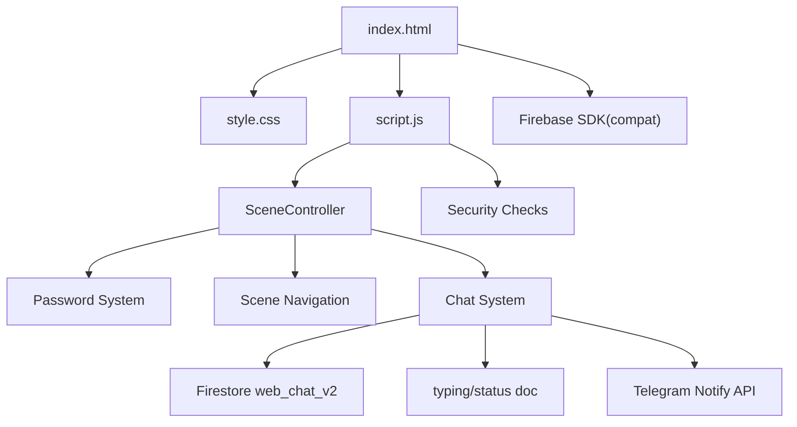

# Project Context

> **Chat audit & enhancements note (2026-08-24, evening)**: Full chat UI/UX pass plus six new features. **Audit fixes**: typing-indicator fade-reuse bug (element + remove-timer now tracked in `remoteTyping`); duplicate `.chat-quote-box`/`.quote-sender`/`.quote-text` definitions consolidated into one flex layout with `.quote-accent-bar` (pink gradient variant on right bubbles); Shift+Enter inserts newline (Enter still sends); connection status is a floating pill above the input bar (`bottom: calc(100% + 8px)`) that animates on state *change* only — amber "Reconnecting…" persists, green "Connected" blip fades after 1.8s; sticky-touch hovers wrapped in `@media (hover: hover)`; dead code removed (`.chat-reply-btn` CSS, `escapeHtml()`, duplicate `@keyframes lockPulse`, duplicate `.toggle-btn transition`); input auto-resize cap aligned at 140px; Firefox `scrollbar-width/color` on `.chat-messages`/`.chat-input`; focus rings extended to `.msg-info-close`/`.pin-key`; edit textarea forced ≥16px on mobile (iOS zoom); URLs in messages render as safe links via `setTextWithLinks()` (createElement-only, http(s)/www schemes only, trailing punctuation trimmed). **Features**: ① tap a reply quote → `jumpToQuotedMessage()` scrolls the original into view with a `.message-highlight` flash ring (missing target → info toast; keyboard accessible); ② double-tap a received *text* message toggles a 💜 heart reaction (`REACTION_EMOJI` const, stored as `reaction: { by }` via optimistic `update()`, badge via `syncReactionBadge()`, hearts burst via existing `createHeart()`; media bubbles excluded — their tap opens the lightbox); ③ presence dot in header — `PRESENCE_DOC = db.doc('presence/status')` heartbeat every 25s, other side offline if last beat >75s (`PRESENCE_STALE_MS`), hidden tab reports offline, torn down with explicit offline write on privacy re-lock; ④ skeleton shimmer rows render while history first loads (skipped when cache warm, removed on first snapshot/empty chat); ⑤ scroll-FAB dot grew into an unread counter pill (`setUnreadCount()`, caps at "99+"); ⑥ WhatsApp-style "New messages" divider above the first missed message (`firstUnseenId`; missed = arrived while scrolled up OR scene inactive — `engaged = wasAtBottom && scene-active`), cleared on reaching bottom/FAB tap, auto-cleared if it ages out of the last-20 window. The long-press Message-info sheet gained swipe-down-to-close and focus management (✕ focused on open, focus restored on close; same for lightbox). A proposed "Copy text" sheet row was **removed** at owner request.

> **Read receipts note (2026-08-24, readBy map)**: Identity is no longer defaulted — `chatState.currentIdentity` starts `null`; after Chat PIN success the `#chat-identity-overlay` forces an explicit Bhatari/Bhandhari choice (never persisted; reset to `null` on every privacy re-lock). WhatsApp-style read receipts: message docs carry `readBy` as a **map of identity → read-at time** (`{ "Bhatari": Timestamp }`; new sends start `{}`), a single `IntersectionObserver` (70% threshold, 300ms dwell, capped ratio for tall bubbles) watches incoming bubbles, and `markMessageAsRead()` writes with an atomic per-reader dot-path update `readBy.<identity> = FieldValue.serverTimestamp()` gated on identity/visibility/unlocked/online. Legacy docs whose `readBy` is still an array are normalized in-memory by `sanitizeReadBy()` (keys with null timestamps) and migrate to the map shape on first read via a one-time full-map write. Ticks: 🕓 pending → ✓ sent → ✓✓ read (blue). Observer disconnects on scene exit and privacy re-lock; identity switch cancels dwell timers. Long-pressing a sent message opens the glass "Message info" bottom sheet (`#msg-info-overlay`, body level) showing sent time + who read it and when.
> **Premium polish note (2026-08-11)**: Chat UI/UX polish layer — motion tokens (`--ease-spring`, `--dur-*`), CSS-driven top-pill toast, grouped message runs, side-aware spring bubble entrances, send choreography + haptics, sliding identity glider (`#toggle-glider`), header compress-on-scroll, scroll-to-bottom FAB (now with unread *count*, see the 2026-08-24 note), empty-state card (now synced via `syncEmptyState()` so it never co-exists with the typing bubble), typing glow breathe, `:focus-visible` rings.
> **Media feature note (2026-08-11)**: Chat now supports image/video attachments uploaded to Cloudinary (unsigned preset `chat_videos`, cloud `dyua5q73q`) and rendered inline via `buildImageMedia`/`buildVideoMedia` (custom lazy video player). See §6 (Firestore Chat System additions), §10 (media field), §13 (Cloudinary constants).
> **Last verified**: working tree with **uncommitted changes** on top of latest commit `8b7df16` (read receipts + identity selection). Line references marked "(~)" are approximate — the file has grown past 3700 lines.
> This document supersedes all earlier versions and reflects the **current** state of the code (post "duplicate date dividers fix + inline edit crash + keyboard overlap + safe areas + alignment constraints" update).

---

## 1. Project Summary

**Confirmed**

- **Project Purpose**: A personalized birthday surprise website for two people, **Bhatari** (sender / left bubble) and **Bhandhari** (recipient / right bubble). Branding references a "Penguin 🐧" mascot.
- **Business/Domain**: Personal celebration/greeting web application with an interactive real-time chat finale.
- **Primary Goals**:
  - Deliver an emotional, cinematic birthday experience
  - Present a visual journey through shared memories (photo ladder)
  - Show a handwritten-style letter (envelope scene)
  - Provide a private, real-time two-way chat as the grand finale
- **Major Features**:
  - Password-protected entry (4-digit code, SHA-256 hash verification)
  - 3-scene sequential experience: Image Ladder → Envelope Letter → Chat
  - "Jump to Chat" shortcut from the ladder scene
  - Chat scene protected by a separate 4-digit PIN + on-screen keypad (lockout on 3 failures)
  - Real-time chat over **Firebase Firestore** with typing indicators, replies, inline edit, date dividers, connection status
  - Identity toggle (Bhatari ↔ Bhandhari) inside the chat
  - "Notify Bhatari" button (Telegram Bot API) with 10s cooldown
  - Privacy re-lock on tab switch (whole app returns to password screen)
  - Offline detection overlay
- **Technology Stack**:
  - HTML5, CSS3, Vanilla JavaScript (no frameworks/build tools)
  - Firebase (Firestore) via compat SDK 10.12.2 for real-time chat
  - Telegram Bot API (server-side-free) for the notify button and legacy reply delivery
- **High-Level Architecture**: Single-page application (SPA) with scene-based navigation, a password protection layer, and two external backends (Firestore for chat, Telegram for notifications).

---

## 2. Repository Instructions

> Before making any changes to the project, always locate and read the repository's `instructions.md` file (if it exists). Treat it as the authoritative source for project-specific development conventions, workflows, coding standards, constraints, and implementation guidelines.

**Status**: The repository contains an `instructions.md` file at `/workspace/instructions.md`. It mandates that terminal commands be actually executed (with full output shown), a strict Git workflow (verify → change → review → commit → push → verify), and a prohibition on destructive git operations. A `task.md` at `/workspace/task.md` also exists; it documents the *planned* Telegram-based chat architecture which **differs from the implemented Firestore-based chat** (see §21 – Discrepancies & Notes).

---

## 3. Architecture

**Confirmed**

### Overall Architectural Style
- **Type**: Client-side Single Page Application (SPA)
- **Pattern**: Scene-based state machine with sequential navigation (`SceneController`)
- **Deployment**: Static files served directly (no backend server)

### System Layers
```
┌──────────────────────────────────────────────┐
│            Presentation Layer                │
│  (index.html - HTML structure & DOM)         │
├──────────────────────────────────────────────┤
│             Styling Layer                    │
│   (style.css - CSS3, glassmorphism, anims)   │
├──────────────────────────────────────────────┤
│           Controller Layer                   │
│   (script.js - SceneController + chat logic) │
├──────────────────────────────────────────────┤
│            External Integration              │
│   (Firebase Firestore via compat SDK)        │
│   (Telegram Bot API via fetch)               │
└──────────────────────────────────────────────┘
```

### Major Subsystems
1. **Password Protection System** — sessionStorage-based lockout (3 attempts → 15s), SHA-256 hash verification
2. **SceneController** — state machine managing 3 sequential scenes (ladder → envelope → chat)
3. **Security Layer** — network monitoring (online/offline) + privacy re-lock on `visibilitychange`
4. **Firestore Chat System** — real-time messaging (`web_chat_v2`), typing status, replies, inline edit
5. **Chat PIN Lock** — second access gate with on-screen keypad and its own lockout
6. **Telegram Integration** — "Notify Bhatari" push; legacy reply delivery (dead)
7. **Visual Effects** — bokeh particles, confetti, floating hearts, envelope/ladder animations

### Dependency Direction
```
index.html → style.css (styles)
index.html → script.js (logic)
index.html → Firebase SDK (scripts)
script.js → Firebase Firestore (chat)
script.js → Telegram Bot API (notify / legacy)
```

### Component Relationships (Mermaid)


### Request Lifecycle
1. Page loads → password overlay displayed (or lockout countdown if previously locked)
2. User enters code → SHA-256 hash validation
3. Success → main content revealed with intro transition → `initMainApp()`
4. `SceneController` starts → Scene 1 (Ladder) shown after ~600ms
5. Navigation: Ladder → Envelope → Chat (or "Jump to Chat" skips to index 2)
6. Chat scene boots Firestore listeners after PIN unlock

### Data Lifecycle
```
Chat: User types → optimistic UI via Firestore snapshot → persisted in Firestore → real-time sync to other identity
Notify: Button click → POST to Telegram Bot API → cooldown countdown → toast
```

---

## 4. Repository Structure

| Directory | Purpose | Responsibilities | Important Contents |
|-----------|---------|------------------|-------------------|
| `/` (root) | Main application | Entry point, core logic | `index.html`, `script.js`, `style.css`, `instructions.md`, `task.md`, `project-context.md` |
| `images/` | Asset storage | Photo assets for ladder scene | `image1.png/webp`, `image2.png/webp`, `image3.png/webp` |
| `songs/` | Audio storage | Background music | `song1.mp3` |

**Dependencies**:
- `images/` referenced by `index.html` (ladder scene `<picture>` with webp + png fallback)
- `songs/` **NOT referenced anywhere** — orphaned asset (see §21)
- `.stylelintrc.json` configures CSS linting (no package.json; no JS linter)

---

## 5. Key Files

| File Path | Responsibility | Why Important |
|-----------|---------------|---------------|
| `index.html` | Application entry point, DOM structure, all 3 scenes, overlays | Defines password/offline overlays, ladder, envelope, chat scene, loads Firebase SDK |
| `script.js` | Application logic, SceneController, chat system, Telegram | Contains password + PIN logic, Firestore chat, typing/reply/edit, notify |
| `style.css` | Visual styling, animations, responsive design | Implements glassmorphism, chat bubbles, PIN pad, mobile-first `100dvh` layout |
| `.gitignore` | Git exclusion rules | Prevents committing build artifacts, deps, temp files |
| `.stylelintrc.json` | CSS linting configuration | Enforces `color-no-invalid-hex`, `block-no-empty` |
| `instructions.md` | Development guidelines | Authoritative source for coding standards and git workflow |
| `task.md` | Original chat implementation plan | Documents the *intended* Telegram architecture (diverged in implementation) |
| `project-context.md` | This document | Technical reference for AI assistants |

---

## 6. Core Modules and Components

### SceneController Class (`script.js:209-320`)
- **Responsibility**: Manages sequential scene navigation and state
- **Scene sequence**: `scene-ladder` → `scene-envelope` → `scene-chat`
- **Public Interface**: `showScene(index)`, `nextScene()`, `previousScene()`, `reset()`
- **Scene entry hooks** (`onSceneEnter`, `script.js:313-319`): `enterLadderScene()`, `enterEnvelopeScene()`, `initChatScene()`
- **Reset behavior** (`script.js:221-272`): hides all scenes, resets ladder cards/scroll-hint, envelope (`envelopeOpened = false`), clears confetti, resets legacy reply box elements (now no-ops — see §21)
- **Note**: legacy `scene-dua`, `scene-q1`–`scene-q5` are gone; chat replaced them

### Password System (`script.js:9-153`)
- **Responsibility**: Authentication gate with lockout protection
- **Public Interface**: `checkPassword()` async function
- **Details**:
  - SHA-256 hash constant at `script.js:17` (`277375b99e…`), also reused as the chat PIN hash (`script.js:1129`)
  - Lockout: 3 failed attempts → 15 seconds, persisted via sessionStorage (`pwd_attempts`, `pwd_lockout_end`)
  - Countdown timer and disabled input/button during lockout; auto-clear on expiry
  - 4-digit input (`maxlength=4`), Enter key and button both submit

### Chat PIN Lock (`script.js:1054-1213`)
- **Responsibility**: Second access gate on the chat scene
- **Details**:
  - On-screen keypad (`.pin-key`) with clear `✕` and backspace `⌫`; dots UI; haptic feedback via `navigator.vibrate`
  - Verifies SHA-256 of the entered 4-digit PIN against the same hash as the main lock (`script.js:1144`)
  - 3 failures → 15s lockout (in-memory `chatState`; resets on re-entry)
  - Randomized input field name/id to defeat browser autofill recognition
  - PIN keypad click listener attached **exactly once** (guarded by `chatLockOverlayInited`, `script.js:1050`/`1093`) — re-entering the chat scene no longer stacks duplicate handlers
  - On success: hides overlay, shows identity toast ("You are chatting as …", `script.js:1176`)

### Firestore Chat System (`script.js` ~928 onward)
- **Firebase config**: `script.js` (~867) (project `web-app-511d5`)
- **Collection**: `CHATS_COL = 'web_chat_v2'` (`script.js:~928`)
- **Typing doc**: `TYPING_DOC = db.doc('typing/status')`
- **Presence doc**: `PRESENCE_DOC = db.doc('presence/status')` — heartbeat-based online indicator
- **Offline persistence**: `db.enablePersistence()` with graceful multi-tab handling
- **Sub-modules**:
  - `initChatScene()` — wires listeners once (`chatSceneInited` guard); identity is NOT defaulted — stays `null` until the post-PIN selector; one-time wiring includes `initMediaAttachments()`, `initMessageInfoSheet()`, `initChatReactions()`, `initHeaderPolish()`, `initIdentitySelector()`
  - `startMessageListener()` — `orderBy('timestamp','asc').limitToLast(20)` real-time snapshot; maps docs through `sanitizeMedia()` / `sanitizeReaction()` / `sanitizeReadBy()`; sets `legacyReadBy` flag for array-shaped readBy; calls `removeSkeleton()` on first snapshot
  - `startTypingListener()` — reads `typing/status` doc for the *other* identity, shows/hides typing bubble
  - **Remote typing robustness** — `showRemoteTypingIndicator()/hideRemoteTypingIndicator()` track the bubble element (`remoteTyping.el`) and its removal timer (`removeTimer`) so rapid stop/start cycles reuse-and-restore instead of leaving an invisible fading bubble
  - `syncEmptyState()` — greeting card shown only when messages are empty AND no typing bubble exists; shared by reconciliation and both typing functions
  - `reconcileMessages()` — smart DOM reconciliation: date dividers (stable calendar-day keys), "New messages" divider insertion, grouped runs, receive-glow vs missed-message branching (`engaged = wasAtBottom && scene-active`)
  - `createBubble()` / `updateBubble()` — bubble rendering incl. tappable reply quote, linkified text (`setTextWithLinks()` + `dataset.raw` change detection), reaction badge (`syncReactionBadge()`), edited tag, Reply/Edit actions, ticks
  - `jumpToQuotedMessage()` — scrolls quoted original into view + flash ring; toast when target is outside the last-20 window
  - **Reactions** — `initChatReactions()` delegated double-tap detector (350ms window, per-identity); `reactToMessage()` optimistic toggle write (`reaction: {by}` set / `FieldValue.delete()`); `burstHearts()` reuses global floating hearts
  - **Read receipts (readBy map)** — see top note; `sanitizeReadBy()` normalizes legacy arrays and Firestore timestamps to ms; `markMessageAsRead()` dot-path writes with `serverTimestamp()`, one-time full-map migration for legacy array docs
  - **Message info sheet** — long-press (480ms) a sent message → glass bottom sheet with sent time + who read it & when; swipe-down-to-close; focus management; live refresh from snapshots via `refreshMessageInfoSheet()`
  - `startEdit()` / `cancelEdit()` — inline editing of own messages (max 2000 chars)
  - `handleSend()` / `sendMessage()` — writes `{sender, text, timestamp: serverTimestamp(), replyTo, isEdited:false, media, readBy:{}}`; restores drafts on failure; Shift+Enter = newline
  - `handleReply()` / `cancelReply()` — reply preview bar + quote box
  - **Presence** — `startPresence()/stopPresence()/refreshPresenceDot()`: 25s heartbeat merge-write into `presence/status`, listener + 15s staleness re-evaluation, header `.presence-dot` toggles `.online`; hidden tab beats offline; re-lock does explicit offline write
  - **Skeleton** — `renderSkeleton()/removeSkeleton()` shimmer shown only when no messages are rendered yet
  - **Unread/divider state** — `setUnreadCount(n)` (FAB counter pill, 99+ cap) and `clearNewMessagesDivider()`; wired into scroll handler (bottom = seen), FAB click, identity selection, and privacy re-lock teardown
  - **Media attachments** — `initMediaAttachments()` wires 📎 button + hidden file input; upload pipeline unchanged (Cloudinary unsigned preset, XHR progress, cancel/retry)
  - **Media rendering** — `buildImageMedia()` / `buildVideoMedia()` / `showMediaErrorIn()` unchanged
  - **Lightbox** — `openLightbox()/closeLightbox()` now manage focus (store opener, focus ✕ on open, restore on close)
  - `setTextWithLinks()` — safe URL rendering into bubbles (DOM-built anchors, `rel="noopener noreferrer nofollow"`)
  - Typing in/out — debounced 3s typing heartbeat, 4s reset
  - `initKeyboardHandling()` — mobile `visualViewport` listeners attached exactly once
  - `updateConnectionStatus()` — change-gated status pill above the input bar (green blip fades after 1.8s; amber persists while reconnecting)

### Telegram Integration (`script.js:620-622`, `904-958`)
- **Credentials** (hardcoded): `TG_BOT_TOKEN` (`script.js:621`), `TG_CHAT_ID = '6219378525'` (`script.js:622`)
- **`notifyBhatari()`** (`904-954`): POSTs a 🔔 message to Telegram when Bhandhari taps "Notify Bhatari"; 10s cooldown with countdown text on the button
- **Legacy `sendReplyToTelegram()`** (`676-711`): formats "New Birthday Reply" Markdown — **dead code** (no live callers, see §21)

### Visual Effects
- **Bokeh particles** (`357-383`): 8 animated background orbs, self-resetting loop
- **Confetti** (`387-416`): mobile-aware count (30 mobile / 50 desktop), cleanup after 4s — only triggered from dead reply path
- **Floating hearts** (`336-344`, `1859-1872`): 💜 on non-button taps, 250ms throttle
- **Envelope/Ladder animations**: CSS-driven (see `style.css` §6)

---

## 7. Data Flow

**Confirmed**

### User Input Flow
```
1. Enter password → SHA-256 → match → reveal content → initMainApp()
2. SceneController shows Scene 1 (Ladder); Continue → Scene 2 (Envelope); Continue → Scene 3 (Chat)
3. Chat requires PIN → Firestore listeners boot → real-time messaging between identities
```

### Chat Message Flow (Firestore)
```
sendMessage():
  db.collection('web_chat_v2').add({sender, text, timestamp: serverTimestamp(), replyTo, isEdited:false, media, readBy:{}})
  → onSnapshot fires → reconcileMessages() renders bubble (pending state until server ack)
incoming:
  snapshot → parse sender (normalizeSender) → create/update bubble → scroll if engaged
reactions:
  double-tap received bubble → optimistic toggle → update({reaction:{by}} | {reaction: FieldValue.delete()})
read receipts:
  IntersectionObserver dwell → markMessageAsRead() → dot-path update readBy.<identity>=serverTimestamp()
presence:
  identity selected → startPresence() → every 25s merge-write online:true into presence/status
                     → hidden tab beats offline; other side's beat >75s old → dot gray
```

### Typing Flow
```
Outgoing: input event → if >3s since last → typing/status.set({[identity]: {isTyping, at}})
          → reset timer (4s) clears typing
Incoming: typing/status snapshot → other identity isTyping && age<6s → show bubble (auto-hide 6s)
```

### Validation Flow
- Password & PIN: SHA-256 via Web Crypto API
- Offline check: `navigator.onLine` blocks sends and shows offline overlay
- Edit: empty / whitespace / unchanged text blocked with toast

### Persistence Flow
- Password attempts/lockout → `sessionStorage`
- Chat messages/typing → Firestore (server-persisted)
- Chat PIN lockout → in-memory only (reset on scene re-entry)

---

## 8. Application Flow

**Confirmed**

### Startup Sequence
1. `DOMContentLoaded` → password system init from sessionStorage
2. Lockout restored if `pwd_lockout_end > now` (countdown)
3. Network status checked (`handleNetworkChange`)
4. Event listeners attached (online/offline, visibilitychange)

### Initialization (post-authentication)
1. `initMainApp()` (`326-350`)
2. Bokeh setup, `SceneController` instantiated, stored as `window._sceneController`
3. Heart-on-click handler attached
4. `controller.showScene(0)` after 600ms → `enterLadderScene()`

### Routing
- No URL routing; scene-based state machine, sequential + jump shortcut
- "Jump to Chat" (`ladder-jump-chat-btn`, `script.js:509-514`) → `showScene(2)`

### Authentication Flow
```
Password Input → SHA-256 → compare hash
  → Success: hide overlay, init app
  → Fail: increment; <3 → remaining attempts msg; >=3 → 15s lockout (disabled UI, countdown)
```

### Event Handling
- Buttons: unlock, ladder continue/jump, envelope seal/close/continue, notify, identity toggle, PIN pad, chat send, reply cancel, edit save/cancel
- Window events: `online`/`offline`, `resize` (ladder string), `visibilitychange` (re-lock)
- Document click: floating hearts

### Shutdown / Re-lock Behavior
- Tab switch (`visibilitychange`) → blackout + full password re-lock; `SceneController.reset()` so experience replays from Scene 1
- sessionStorage cleared on tab close

---

## 9. State Management

**Confirmed**

### Global State
- `window._sceneController`: SceneController instance (`script.js:332`)

### Chat State (`chatState`)
| Field | Purpose |
|-------|---------|
| `currentIdentity` | `'Bhatari'` or `'Bhandhari'`; starts `null` — forced choice on the post-PIN selector, reset to `null` on every privacy re-lock |
| `messages` | Message array from Firestore snapshot (normalized: `readBy` map in ms, `reaction {by}`, `legacyReadBy` flag) |
| `unsubMessages` / `unsubTyping` / `unsubPresence` | Firestore unsubscribe functions |
| `replyToMessage` | Active reply target `{id, text, sender}` |
| `lastTypingSentTime` / `typingResetTimer` | Outgoing typing throttling |
| `remoteTyping` | `{ sender, timer, el, removeTimer }` — element + fade timer tracked to prevent invisible-bubble reuse bug |
| `renderedIds` | `Map<id, DOMElement>` for reconciliation (also used by quote jump) |
| `editingMessageId` / `editBoxes` | Inline edit tracking |
| `chatUnlocked`, `pinInput`, `failedAttempts`, `lockoutEndTime` | Chat PIN lock state |
| `pendingAttachment`, `activeVideo`, `mediaObserver` | Media upload / playback state |
| `identitySelecting` | Double-click guard for the identity selector |
| `readObserver`, `readTimers`, `readPending` | Read-receipt observer singleton, dwell timers, writes-in-flight |
| `infoSheetMessageId` | Message shown in the long-press info sheet (`null` = closed) |
| `reactionPending` | Message ids with a reaction toggle write in flight |
| `unreadCount` | Missed incoming messages (drives FAB counter pill) |
| `firstUnseenId` | Id of first missed message — anchors the "New messages" divider |
| `presenceData`, `presenceHeartbeat`, `presenceEvalTimer` | Presence snapshot payload + heartbeat/staleness interval handles |
| `unsubPresence` | Presence doc listener unsubscribe |

### Password State
- `failedAttempts`, `lockoutEndTime`, `isLockedOut` (backed by sessionStorage)

### Persistence Strategy
- Chat data: Firestore (persistent, cross-device)
- Password lockout: sessionStorage (volatile per tab session)
- Chat PIN lockout: memory only

---

## 10. Database and Storage

**Confirmed**

- **Primary**: Firebase Firestore
  - Collection `web_chat_v2`: chat messages
  - Document `typing/status`: real-time typing indicator
  - Document `presence/status`: presence heartbeats `{ [identity]: { online: bool, at: serverTimestamp } }` (merged writes)
- **Local**: `sessionStorage` for password lockout; browser cache for static assets
- **Schema**: Firestore is schemaless; message shape is set by the writer (see §13)
  - Message doc: `{ sender, text, timestamp, replyTo, isEdited, media, readBy, reaction }`
  - `readBy`: **map** of identity → read-at (`{ "Bhatari": Timestamp }`); new sends start `{}`; legacy array docs migrate on first read
  - `reaction`: `null | { by: 'Bhatari'|'Bhandhari', at }` — single slot; only the recipient reacts (double-tap toggles)
  - `media`: `null | { type: 'image'|'video', publicId, url, width, height, duration, format, bytes }` — validated by `sanitizeMedia()` on read
  - `reaction` validated by `sanitizeReaction()` on read
- **ORM**: None (raw Firestore compat SDK calls)

---

## 11. APIs

### Internal APIs
None (monolithic frontend application). Shared helpers: `normalizeSender`, `formatDateLabel`, `showToast`, `updateConnectionStatus`.

### External APIs

**Firebase Firestore** (`script.js:867-894`)
- **Service**: Google Firebase (project `web-app-511d5`)
- **Endpoints**: collection `web_chat_v2`; documents `typing/status` and `presence/status`
- **Authentication**: web API key + Firestore Security Rules (rules not in repo — must be configured in Firebase console)
- **Error Handling**: snapshot error → `updateConnectionStatus(false)`; persistence errors warn and degrade gracefully

**Telegram Bot API** (`script.js:904-958`)
- **Service**: Telegram Messenger
- **Endpoint**: `https://api.telegram.org/bot{TOKEN}/sendMessage`
- **Auth**: bot token in URL (hardcoded `script.js:621`)
- **Payload**: `{chat_id: "6219378525", text, parse_mode: "HTML"}` for notify
- **Error handling**: non-ok response → toast + button re-enabled
- **Rate limiting**: 10s cooldown on notify button
- **Note**: legacy `sendReplyToTelegram` (Markdown `sendMessage`) is dead code

---

## 12. Authentication and Security

**Confirmed**

### Authentication Flow
- **Main lock**: SHA-256 hash comparison (`script.js:17`); hash `277375b99e186c72ac38ac47b03199038342fe0389be8765476fa2be0c5b5649`
- **Chat lock**: same hash reused as PIN verification (`script.js:1144`)
- **Session management**: sessionStorage attempt/lockout tracking

### Authorization Model
- Binary per gate: locked vs unlocked (password + PIN); no roles
- Identity is a UI toggle, not an auth boundary — any visitor can message as either identity

### Secret Management (⚠️)
- **Telegram bot token** hardcoded & exposed in client (`script.js:621`)
- **Telegram chat ID** hardcoded (`script.js:622`)
- **Firebase web config** hardcoded (`script.js:867-874`) — web API keys are public by design; actual protection is the Firestore rules
- **Password/PIN hash** stored client-side (obscurity only)

### Encryption / Validation
- SHA-256 hashing for password/PIN (obfuscation, not real security)
- Chat messages rendered via `textContent`; URL linkification builds anchors with DOM APIs only (no innerHTML), restricted to `http(s)://` / `www.` schemes with `rel="noopener noreferrer nofollow"` — stored-XSS posture unchanged
- Network status checked before sends and reaction toggles

### Security-Sensitive Areas
1. Hardcoded Telegram bot token (real credential; anyone can hijack the bot)
2. Client-side auth + reused hash (no server enforcement)
3. Firestore rules out-of-repo — if overly permissive, chat is writable by anyone
4. No input sanitization server-side (Firestore security rules would be the enforcement point)
5. Identity impersonation possible (anyone can toggle to either identity)

---

## 13. Configuration

**Confirmed**

### Environment Variables
None. All configuration is hardcoded in `script.js`.

### Config Files
- `.stylelintrc.json`: `color-no-invalid-hex`, `block-no-empty`

### Feature Flags
None.

### Runtime Configuration (hardcoded)
- `CORRECT_PASSWORD_HASH` / `CORRECT_PIN_HASH`: top of `script.js`
- `TG_BOT_TOKEN`, `TG_CHAT_ID`: `script.js` (~620)
- `FIREBASE_CONFIG`: `script.js` (~867)
- `CHATS_COL = 'web_chat_v2'`, `TYPING_DOC`, `PRESENCE_DOC`: `script.js:~928-930`
- `CLOUDINARY_CLOUD_NAME = 'dyua5q73q'` / `CLOUDINARY_UPLOAD_PRESET = 'chat_videos'` — unsigned uploads only; API secret must NEVER be in client code
- Media limits: images ≤ 25 MB, videos ≤ 100 MB
- Lockout: 3 attempts / 15s (both locks)
- Notify cooldown: 10s
- Typing throttle: 3s out / 6s in auto-hide
- Message cap: 2000 chars (edit input maxLength)
- Snapshot window: last 20 messages
- Read receipts: 70% visibility threshold, 300ms dwell (`READ_VISIBILITY_THRESHOLD` / `READ_DWELL_MS`), 0.4 ratio for tall bubbles
- Long-press info sheet: 480ms hold; double-tap reaction window: 350ms
- Presence: 25s heartbeat, 75s staleness cutoff
- Input auto-resize cap: 140px (matches CSS `.chat-input` max-height)

### Build Configuration
None (no build process; static files served directly).

---

## 14. Dependencies

**Confirmed**

### External Libraries (CDN in `index.html`)
| Library | Purpose | Why Exists |
|---------|---------|------------|
| Google Fonts (Outfit, Lora, Caveat, Playfair Display) | Typography | Cinematic, emotional design aesthetic |
| Firebase App compat SDK 10.12.2 (`index.html:296`) | Firebase bootstrap | Initialize Firestore |
| Firebase Firestore compat SDK 10.12.2 (`index.html:297`) | Real-time database | Chat backend |

### Built-in APIs Used
| API | Functionality | Architectural Significance |
|-----|---------------|---------------------------|
| `fetch` | Telegram notify calls | Push notifications without a backend |
| `sessionStorage` | Lockout persistence | Survives page reloads |
| `crypto.subtle` (Web Crypto) | SHA-256 hashing | Password/PIN verification |
| `navigator.onLine` / window events | Network detection | Offline UX |
| `navigator.vibrate` | Haptic feedback | Mobile polish (PIN pad, envelope) |
| `requestAnimationFrame` | Smooth transitions | Cinematic effects |

### No npm/package.json
- Pure vanilla JS + Firebase CDN; zero build dependencies

---

## 15. Development Workflow

**Inferred** (based on file structure and absence of tooling)

### Installation
- None required; clone repository and serve static files

### Local Development
- Option 1: Open `index.html` directly in a browser
- Option 2: Simple HTTP server (e.g., `python3 -m http.server`)
- Option 3: VS Code Live Server extension

### Build Process
- None; files are production-ready as-is

### Testing
- Manual testing in browser; no automated test suite

### Linting
- CSS: stylelint (minimal rules in `.stylelintrc.json`)
- JavaScript: none configured

### Formatting / Type Checking
- None (vanilla JS)

### Deployment
- Host static files anywhere with HTTPS
- **Critical**: Firestore Security Rules must be configured in the Firebase console (they live server-side, not in this repo)
- Update Telegram bot token / Firebase config if changed

### CI/CD Workflow
- None configured; manual deployment expected

---

## 16. Coding Conventions and Project Patterns

**Inferred** from existing codebase

### Folder Organization
- Flat root with `images/` and `songs/` asset dirs; all logic in root files

### Naming Conventions
- **CSS**: kebab-case selectors; `--kebab-case` variables in `:root` (`style.css:6-31`)
- **JS**: camelCase functions/vars, PascalCase class (`SceneController`), `const` section constants
- **HTML IDs**: kebab-case with prefixes (`scene-`, `chat-`, `ladder-`, `envelope-`, `pin-`)

### Error Handling
- `try/catch` around async Firebase writes and PIN hashing; `console.error`/`console.warn`
- User-facing toasts (`showToast`) for chat errors; inline error messages for locks

### Logging
- `console.error()` for failures; `console.warn()` for persistence/typing issues
- Note: old docs claimed a "security layer clears console.log" — no such clearing exists in current code

### Async Patterns
- `async/await` with fetch (Telegram); Firestore SDK promises + `onSnapshot` callbacks

### Architectural Patterns
- State machine (`SceneController`), event-driven DOM, real-time sync via Firestore listeners, smart DOM reconciliation (no full re-render)

### Comment Style
- ASCII-art section banners (`/* ===== … ===== */`, `// ─── … ───`), inline notes; some comments are **stale** (see §21)

---

## 17. Business Logic

**Confirmed**

### Domain Concepts
- **Birthday Celebration**: core purpose; all features serve this goal
- **Journey Narrative**: "Then · Now · Always" ladder theme; handwritten letter
- **Real-Time Exchange**: chat replaces the earlier Q&A reply scenes

### Workflows
1. **Unlock Flow**: password → content (progressive lockout)
2. **Scene Navigation**: linear ladder → envelope → chat (+ jump shortcut)
3. **Chat Flow**: PIN unlock → identity toggle → message/reply/edit → Firestore sync
4. **Notify Flow**: Bhandhari taps Notify → Telegram message → cooldown

### Validation Rules
- Password/PIN: SHA-256 must match stored hash
- Message: non-empty; edit: non-empty, changed
- Network required for sending
- 3 attempts → 15s lockout on both locks

### Decision Logic
- Lock success → reveal; failure <3 → remaining attempts; ≥3 → lockout
- Offline → block + overlay; empty message → toast/block
- Reply target → preview bar; cancel → clears; tap quote → jump to original (toast if outside last-20 window)
- Identity toggle → re-render edit-button visibility + notify button visibility
- Edit unchanged → cancel; save error → re-enable inputs + copy text to clipboard
- Incoming message: engaged (`wasAtBottom && scene-active`) → haptic + glow; else → unread count++ and anchor "New messages" divider
- Double-tap received text message → toggle reaction write; own messages long-press → info sheet instead
- Read receipts: dot-path `serverTimestamp()` write for map docs, full-map migration write for legacy array docs

---

## 18. Known Limitations

**Confirmed**

### Technical Debt / Issues
1. **Hardcoded secrets in client** — Telegram bot token + chat ID, Firebase config, password/PIN hash (`script.js` top + config block)
2. **Dead code (legacy reply/question system)** — see §21C/§21D for the full list (chat-scoped dead code was cleaned on 2026-08-24; legacy scene code remains)
3. **Orphaned asset** — `songs/song1.mp3` referenced nowhere; empty "MUSIC PLAYER SCENE STYLES" CSS block
4. **Dead CSS** — legacy reply-box, question-scene, dua styles remain (`style.css:1321-1872` region)
5. **No automated tests**, no JS linting, no CI
6. **Re-lock UX**: any tab switch forces full password re-entry and scene reset
7. **Client-side security theater** — hash-based locks are bypassable via DevTools; Firestore rules are the real enforcement (not in repo)
8. **Rolling history window** — only the last 20 messages load; quote-jump targets older than that show an info toast instead of jumping

### Edge Cases (handled)
- Multi-tab: `enablePersistence` warns `failed-precondition`
- Long messages truncated in quote previews (60/70 chars) and edit cap 2000
- Message send failure → draft text/media restored to composer
- Timestamp fallback to `Date.now()` when `serverTimestamp` pending
- Legacy array-shaped `readBy` → normalized with null timestamps, migrated on first read
- Quote jump to unloaded history → info toast, no crash
- Rapid typing stop/start → typing bubble reused without going invisible
- Missed messages while scene hidden or scrolled up → unread count + divider; state wiped on privacy re-lock and fresh identity selection
- Double-tap detection ignores quotes, action buttons, links, media (each has its own click behavior)

### Edge Cases
- Multi-tab: `enablePersistence` warns `failed-precondition`
- Long messages truncated in quote previews (60/70 chars) and edit cap 2000
- Message send failure → toast, input text already cleared (potential data loss)
- Timestamp fallback to `Date.now()` when `serverTimestamp` pending

### Assumptions
- Two trusted people (Bhatari/Bhandhari) share the chat
- Trusted hosting environment
- Firebase project + Telegram bot remain active

### Design Tradeoffs
- Simplicity over security (personal gift)
- Vanilla JS + Firebase CDN over a framework/build system
- Hardcoded config over environment variables

---

## 19. File Reference Index

| Repository Path | Responsibility |
|-----------------|---------------|
| `index.html` | HTML structure: overlays, 3 scenes, Firebase SDK loading |
| `script.js` | All logic: locks, SceneController, Firestore chat, Telegram, effects |
| `style.css` | All visual styling, animations, responsive design |
| `instructions.md` | Development guidelines & git workflow |
| `task.md` | Original (superseded) Telegram chat implementation plan |
| `project-context.md` | This document |
| `.gitignore` | Git exclusion patterns |
| `.stylelintrc.json` | CSS linting configuration |
| `images/image1.png`, `image1.webp` | Childhood photo (ladder) |
| `images/image2.png`, `image2.webp` | Growing up photo (ladder) |
| `images/image3.png`, `image3.webp` | Current photo (ladder) |
| `songs/song1.mp3` | **Orphaned** audio asset (not referenced) |

---

## 20. AI Working Notes

**Guidance for Future AI Assistants**

### Safe Places to Modify
- `style.css`: add styles following `:root` variable + section-banner pattern
- `index.html`: text content, chat scene markup (match IDs used by `script.js`)
- `script.js`: chat scene logic (Firestore collection name, listeners, bubble rendering)

### Files Requiring Coordinated Changes
- Adding a chat feature requires: HTML (`index.html` chat scene) + CSS (`style.css` chat section) + JS (`script.js` chat module) + optional Firestore rules in the console
- Changing chat storage: update `CHATS_COL` (`script.js:896`) **and** any Firestore rules

### Hidden Coupling
- Scene IDs must match `SceneController.scenes` array (`script.js:212-216`)
- DOM IDs referenced by JS must exist in HTML (see §5; verify before editing)
- Chat identity strings `'Bhatari'` / `'Bhandhari'` are coupled to `normalizeSender` (`script.js:1016-1021`), toggle `data-identity` attributes, and the typing doc keys
- The same SHA-256 hash gates both the main lock and the chat PIN

### Frequently Overlooked Dependencies
- Firebase compat SDKs loaded at `index.html:296-297` before `script.js`
- Google Fonts affect all typography
- Firestore Security Rules (outside repo) control who can read/write `web_chat_v2`
- Notify feature depends on `TG_BOT_TOKEN`/`TG_CHAT_ID` (`script.js:621-622`)

### Common Implementation Pitfalls
1. Editing DOM elements the JS no longer references (legacy reply system) — dead code
2. Forgetting Firestore rules when changing collection names
3. Not handling offline/`navigator.onLine` in new chat features
4. Re-introducing XSS: always render message text via `textContent`/`textContent`-equivalent
5. Breaking the identity/typing coupling when renaming identities

### Recommended Order for Implementing New Features
1. Update `chatState` and DOM IDs in HTML
2. Add CSS following the chat scene patterns
3. Implement JS with proper listener wiring (guard with `chatSceneInited`; wrap one-shot window/DOM listeners in their own flags, e.g. `chatLockOverlayInited` / `keyboardHandlingInited`)
4. Update Firestore rules in the console
5. Test on mobile + offline + multi-tab

### Areas to Modify Cautiously
- **Firestore collection/doc names**: breaks persistence & rules
- **Telegram creds**: breaks notify
- **Password/PIN hash**: breaks access control
- **`SceneController` core**: central to navigation
- **Re-lock (`visibilitychange`)**: privacy behavior users rely on

### Verification Checklist Before Committing
- [ ] Main password works (4-digit code matching hash)
- [ ] Chat PIN unlocks chat; identity selector forces a choice
- [ ] All 3 scenes + "Jump to Chat" navigate correctly
- [ ] Messages send/receive in real time across two identities
- [ ] Reply quoting works; tapping a quote jumps to the original with flash
- [ ] Inline edit, typing indicators work (typing bubble survives rapid stop/start)
- [ ] Double-tap on received text message toggles 💜 reaction (and untoggles)
- [ ] Long-press own message opens info sheet; swipe-down closes it
- [ ] Read ticks: 🕓 → ✓ → ✓✓ blue; legacy array readBy docs migrate without errors
- [ ] Presence dot goes green when other identity is live elsewhere, decays offline
- [ ] Skeleton shimmer on cold identity selection; not over warm cache
- [ ] FAB unread counter increments when scrolled up / scene hidden; divider clears at bottom
- [ ] URLs render as safe links; Shift+Enter newline; Enter sends
- [ ] Notify Bhatari posts to Telegram + cooldown countdown
- [ ] Offline overlay + re-lock on tab switch function (unread/divider/skeleton/presence all reset)
- [ ] Mobile layout (`100dvh`) with keyboard open; no iOS zoom on inputs
- [ ] No console errors

### When in Doubt
1. Read `instructions.md` first for workflow requirements
2. Re-check §21 Discrepancies before touching legacy code
3. Search for existing patterns before implementing new ones
4. Preserve emoji usage in user-facing messages (part of brand voice)

---

## 21. Discrepancies, Drift & Flagged Items

This section documents everything that differs from the previous `project-context.md`, from `task.md`, or that needs attention.

### A. Implementation vs `task.md` (major)
`task.md` specified a **Telegram Bot API**-backed chat (getUpdates polling every 3s, `__TYPING__::` payloads with auto-delete, `Bhatari:`/`Bhandhari:` text-prefix parsing, channel `-1003904588299`, identity via `<select id="chat-identity-select">`). The actual implementation uses **Firebase Firestore** instead: `web_chat_v2` collection, `typing/status` doc, toggle buttons (not a `<select>`), inline edit, date dividers. `task.md` should be considered **superseded/outdated**.

### B. Previous `project-context.md` vs current code (drift)
| Item | Old doc said | Current reality |
|------|-------------|-----------------|
| Scenes | 5 (ladder, envelope, dua, q1–q5) | **3** (ladder, envelope, chat) |
| Chat backend | Telegram Bot API | **Firestore** |
| Chat features | Q&A replies | Real-time chat + PIN lock + replies + edit + typing |
| Line refs | e.g., `script.js:614` token | moved to `script.js:621` |
| Security layer | "clears console.log" | no such behavior in code |
| Audio | music in envelope | `songs/song1.mp3` orphaned; music player removed |

### C. Dead code (JS) — references DOM elements that no longer exist in `index.html`
- `sendReplyToTelegram()` (`676-711`) — no live callers (only called from `setupSendHandler` path)
- `setupSendHandler()` (`736-833`) and its call sites (`836-860`) — target `send-reply-btn-qN`, `reply-qN`, `send-reply-btn`, `reply-message`, `char-count`, `reply-feedback`, `btn-spinner`, `send-btn-label` — **all absent from HTML**
- `enterDuaScene()` (`624-651`) — never called
- `.nav-btn` handler (`718-733`) — no `.nav-btn` elements exist; also references `prev-btn-final`
- `reset()` references to `reply-message`, `char-count`, `reply-feedback`, `send-reply-btn` — no-ops
- `fireConfetti()` (`387-416`) — only reachable from the dead send path

### D. Dead CSS (style.css)
- `SCENE 5 — REPLY BOX` (`1321-1588`), `QUESTION SCENE STYLES` (`1665-1737`), `MUSIC PLAYER SCENE STYLES` (`1873-1877`, empty) — orphaned

### E. Resolved Latent Bugs (Completed)
1. **`charCounter` is undefined (Fixed)** — Now fully resolved. Created the `.chat-edit-char-counter` element inside `startEdit()` and updated its value dynamically in the input listener, eliminating the `ReferenceError` crashes.
2. **`updateBubble` queries incorrect class (Fixed)** — Now targets `.chat-edit-btn` directly inside the bubble rather than `.chat-actions-row` or generic `.chat-action-btn`, making edit-button toggles fully functional.
3. **`updateBubble` targets wrong button (Fixed)** — Resolved by specifically selecting the `.chat-edit-btn` instead of the first `.chat-action-btn` (the Reply button).
4. **Notify button default mismatch (Fixed)** — Aligned the initial state of the identity toggle in `index.html` (making Bhandhari the default active identity in the HTML markup as well as in `script.js`) to match initial JS defaults, eliminating initial flicker and showing "Notify Bhatari" properly on load.

### F. Security concerns (need your input)
- Telegram bot token is a live credential in client code; consider rotating/restricting if exposed beyond this personal project.
- Firestore Security Rules are not in the repo — verify in the Firebase console that `web_chat_v2` and `typing/status` are properly locked down.
- Same hash reused for main lock and chat PIN; client-side hashing is bypassable — acceptable only as casual obscurity.

### G. Suggested next steps (awaiting your decision)
- Decide whether to remove the dead legacy reply/question code + CSS (large cleanup) or keep for reference.
- Decide what to do with the orphaned `songs/song1.mp3` (reintegrate a music player or remove).
- Consider moving secrets to env-var-style config (would require a small build step or hosted config file).

### I. Recent Fixes (Committed)
1. **Duplicate chat-scene listeners fixed** (`script.js`) — `initChatLockOverlay()` and `initKeyboardHandling()` are now guarded via initialization flags, preventing handlers from stacking when re-entering the scene.
2. **Info toasts styled as errors fixed** (`script.js`) — Pass `false` into `isError` parameter for blue info toasts.
3. **Duplicate and orphaned date dividers fixed** (`script.js`) — Restructured date dividers to use stable calendar-day keys (e.g. `divider-2026-8-8`) rather than milliseconds, preventing duplicates when server timestamp updates, and added active cleanup for orphaned dividers in the DOM reconciliation.
4. **Layout constraints & padding fixed** (`style.css`) — Overrode general `.scene` padding/centering styles on `#scene-chat` to let the chat scene expand edge-to-edge.
5. **iOS Safe Areas and Keyboard overlap fixed** (`script.js` & `style.css`) — Utilized `window.visualViewport.height` to dynamically size `.chat-scene` in pixels on mobile, preventing overlap. Configured `padding-bottom` on `.chat-input-bar` with safe-area calculations, dynamically resetting it when the keyboard is open.
6. **XSS risk in reply preview resolved** (`script.js`) — Replaced direct `innerHTML` injection with programmatic `document.createElement()` and `textContent` assignments in the reply preview window.

### J. Recent Changes 2026-08-24 (working tree, uncommitted)
Three working sessions on top of commit `8b7df16`. All verified via `node --check` + CSS brace balance + manual browser pass; **not yet committed** at time of writing.

**Session 1 — readBy map + Message info sheet:**
1. `readBy` converted from array to map of identity → read-at ms; `markMessageAsRead()` writes atomic per-reader dot-path updates with `FieldValue.serverTimestamp()`; legacy array docs flagged (`legacyReadBy`) and migrated once via full-map write; ticks unchanged.
2. Long-press (480ms) a sent message → glassmorphism bottom sheet (`#msg-info-overlay`, body level) showing sent time + who read it & when; live-updates from snapshots; closes on backdrop/✕/Escape/re-lock/scene-exit/identity-switch.

**Session 2 — Full chat UI audit (fixes):**
3. Typing indicator invisible-bubble bug fixed (element + removal timer tracked).
4. Duplicate quote-box CSS consolidated; double accent stripe removed; pink accent variant for right bubbles.
5. Shift+Enter = newline; connection status pill rework (change-gated, fades when connected); sticky-touch hovers wrapped in `(hover: hover)`.
6. Dead code removed: `.chat-reply-btn` CSS, `escapeHtml()`, duplicate `lockPulse`, duplicate `.toggle-btn transition`.
7. Safe URL linkification in bubbles (`setTextWithLinks`); input cap aligned at 140px; Firefox scrollbars; focus rings extended; edit textarea ≥16px on mobile (iOS zoom); lightbox/sheet focus management; sheet swipe-down-to-close.

**Session 3 — Owner request:** "Copy text" row removed from the info sheet completely.

**Session 4 — Six enhancements:**
8. Tap quote → jump to original message + flash highlight (`jumpToQuotedMessage`, `.message-highlight`).
9. Double-tap 💜 reactions on received text messages (`reaction: {by}` field, optimistic toggle, badge + heart burst).
10. Presence dot in header (`presence/status` doc, 25s heartbeat, 75s staleness).
11. Skeleton shimmer while history first loads.
12. FAB unread counter pill (caps "99+").
13. "New messages" divider anchored at `firstUnseenId`; missed = arrived while scrolled up or scene inactive; cleared at bottom / FAB / re-lock / fresh identity selection.

**Firestore note:** the new `presence/status` document should be covered by the same security rules as `typing/status` (verify in Firebase console).

---

## 22. Testing Strategy (current)

**Confirmed**

- **No automated tests** exist (no `package.json`, no test runner).
- Validation is **manual** in-browser against the checklist in §20.
- No JS linting; CSS linting is stylelint with 2 rules; JS syntax checked via `node --check script.js`; CSS brace balance verified ad hoc.
- Before committing any future change, run: `git diff` review and a manual browser pass covering the full §20 checklist (password → scenes → chat → receipts/reactions/presence → re-lock).

## 23. Contribution Guidelines

- Read `instructions.md` before touching the repo; it mandates executing commands, showing full output, and a commit→push workflow.
- Keep changes minimal, focused, and consistent with existing naming/comment conventions.
- Never commit generated/temp files (see `.gitignore`).
- When editing chat features, keep Firestore collection name, DOM IDs, and identity strings in sync.
- Do not hardcode new secrets; flag any existing ones for the owner.
- No automated validation is available — rely on the §20 verification checklist.
